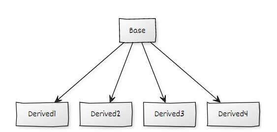
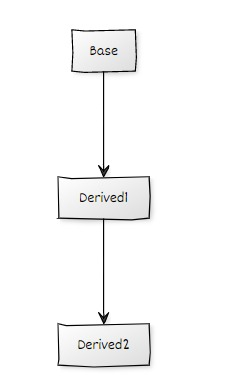
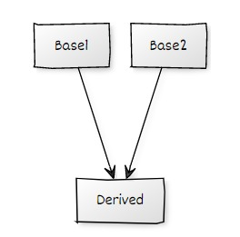
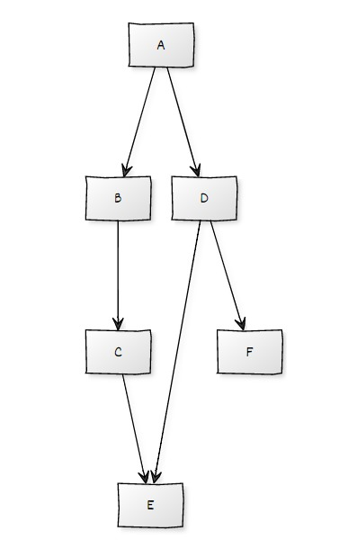

# Object Oriented Programming

1. TOC
{:toc}

# Class
Its like a signature which consists all data methods access specifiers etc

```cpp
class Person{
    // your Code
}; 
```
- this is a pointer to the class itself

```cpp
class Person{
    int a=10;
public:
    Person(int a){
        cout<<a;//5
        cout<<this->a;//10
    }
};
int main(){
    Person p(5);
}
```

# Object
Instance of class is called a object
```cpp
Person P;
```
Some Other terms in class
- data : all data elementrs
- methods: all functions
- constructor: A method with name of class (no return type needed)
- Destructor: A method with name ~followed by name of class
- Constructor is called at initialization of class
- Destructor is called at end of class (when class scope ends);
 
# Static Data in Class(DOUBT HERE)
- Data is not created in every instance
- It is the shared data between all instances
- We can access static data by using acessSpecifier (::) 

```cpp
class Person{
    static int x;
    static printX(){
        cout<<x;
    };
}
int main(){
    Person::x=5;
    Person::printX();//5 is printed
}
```
Example2:
```cpp
class Person{
    static int x;
    static printX(){
        cout<<x;
    };
    Person(){
        x+=2;
    }
}
int main(){
    Person::x=5;
    Person::printX();//5 is printed
    Person p;
    Person::printX();//7 is printed
}
```

# Abstraction
Hiding Unnesassary data
## Acess Specifiers
-  ```public```: Allowed from anywhere
-  ```private```: Allowed only in class
-  ```protected```: Allowed in class and in inherited classes

# Encapsulation
The process of placig all methods data and related content at one place is called Encapsulation
# Inheritence
> A process of achiving parent child relation

```cpp
class Base{
public:
    Base(){
        cout<<"Base";
    }
};
class Derived:public Base{
    Derived():Base(){
        cout<<"Derived";
    }
};
int main(){
    Derived D;
}
```
> Output: Base Derived

At first constructor of base is called and then constructor of derived is called
## Hierchial Inheritence
> Many classes derives from same base class


## Multi Level Inheritence
> A class can be derived from other derived class


## Multiple Inheritence
> A class can be inherited from more than one base classes


```cpp
class Base1{};
class Base2{};
class Derived:public Base1,public Base2{
    Derived():Base2(),Base1(){

    }
}
```
> execution of constructors : Base1 Base2 Derived

- It follows the order specified after ```class Derived:```

## Hybrid inheritence
> A mixture of one or more types

Example


## Access specifiers of base class
```cpp
class Base(){
    public: int a;
    protected: int b;
    private: int c;
};
class Derived1:public Base{

};
class Derived2:protected Base{

};
class Derived3:private Base{

};
```

| Type | A(public) | B(protected) | C(private) |
|----|----|----|----|
|Derived1(public)|public|protected|private|
|Derived2(protected)|protected|protected|private|
|Derived3(private)|private|private|private|

> its too simple just upgrade the access time to as much as possible ```public<protected<private```
> 
> i.e max(accessType in base,accessType when deriving)

# Polimorphism
> many forms in one name

## Compile Time polimorphism
> Resolves at compile time

- functional overloading
- operator overloading

## Functional Overloading
- same name can be used multiple times.
- Which code to use will depend on set of arguments passed.
- All these types of overloading are possible.

```cpp
func();
func(int a);
func(double a);
func(int a,int b);
func(int a,double b);
```

## Operator overloading
- same as function overloading but we use operatrs here
-  No of arguments must be fixed i.e 2 for binary and 1 for unary operands.

```cpp
int operator+(int a,int b){

}
```
- we can reduce one argument while using in a class and then first arg is from class

```cpp
class Person(){
    int val;
public:
    int operator+(int a){
        return this->val+a;
    }
}
```
- list of symbols which cant be overloaded
```WIP```

## Function hiding
> while using inheritence if a function of base class is rewritten in derived class then all copies of the function in base class are no longer useful and those which are in dervied class are used

Example
```cpp
class Base{
public:
    func();
    func(int,int);
    func(int);
    func(int,double);
};
class Derived:public Base{
public:
    func(int);//as this is declared all the four func methods in Base are no longer accessible  (THEY ARE HIDDEN);
};
```
(NO LONGER ACCESSIBLE FROM OUTSIDE BUT CAN BE USED INTERNALLY(DOUBT HERE))

