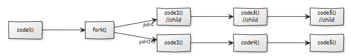

# Process Control
## Process Creation
A Process is created in many ways which include
- **Creation by User**: when we open a app/code 
- **System Initialization**: Some processes may be initialized by sytem or kernal directly. Many processes will automatically start at starting of system.
- **BatchJobs**: Processes which run as sheduled. (no further user interaction needed)
- **By Running Process**: A process may be created by some other process
## Process Termination
A Process can be terminated in many ways which include
- Naturally completed: End of program
- Intrupt by user: probablly with signals
- Any Failure
- Memory scarcity: If process needs much memory
- Need of Other Resource: If a process requests to access resourses other than alloted it will be killed (Ex: Segmentation fault)
- Parent Process: May be terminated by parent process or sometimes if parent process is killed all child processes will be killed 
## Parent and Child Processes
When a process $A$ creates a process $B$ then process $A$ is called Parent process and process $B$ is called child process.
## System Calls
### fork()
fork creates a copy of all next instructions which need to be run in child process with all current data
```c
#include <stdio.h>
#include <sys/types.h>
#include <unistd.h>
int main(){
    printf("1");
    fork();
    // At the above point the code is splitted into 2 parts Parent and child 
    // you can assume like a bacteria which is giving birth to a new child
    printf("2");//this will be printed twice. once from parent once from child
    return 0;
}
```

The return type of fork is a pid_t (process number)
```c
pid_t fork();
```
Here the pid value is different in parent and child processes
- in parent we will get pid of child process
- in child we get 0 as return
By taking advantage of this we can make some changes in our code
```c
int main(){
    code1();
    pid_t pid=fork();
    code2();
    if(pid==0){
        //child
        code3();
    }else{
        //parent
        code4();
    }
    code5();
}
```
In above code The execution process is 

  

we can see ```code3()``` is working in only child and ```code4()``` is working only in forked child process
### exit()

### wait()

### kill()

## Signal Handling

## Process Sheduling Stratagies
### FCFS

### SPN

### SRT

### Round Robin

### HRRN

### Fair Share Sheduling
