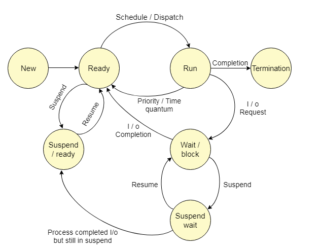

# Process Data Structures and Satte Transictions
## Process Management
## Basic definations
## Process table
The process table is a data structure maintained by the operating system to facilitate context switching and scheduling, and other activities

- Each Process is alloted by a unique identification number (PID)
- This is connected to PCB to have a control over all processes
- Here the process means any task. My be a small c++ code which adds 2 numbers
## PCB (Process Control Block)
- PCB stores all the meta details related to project.
- Meta details include 
  - **process state**: The current state of the process (you can think of a c++ sum of two numbers code whch is stopped after scanning. Now so much data is stored so that if we go to another process and comes back here we can continue)
  - **pointer**: A stack pointer required to remember when we are going to other process
  - Process Number: PID
  - **Program Counter (PC)**: stores the address of next instruction which needs to run
  - **Memory Limits**: All memory occupied for the process
  - **Open FIles list**: Files opened for the purpose of process 
  1](images/pic_1619606193330.png)  

- Here Process table stroes pid and pcb pointer
- PCB stores all the meta data reg process
- As all the current systems are multi processing enables these 2 parts are needed.
## PTE (Process Table Entry)
- Each entry to the process table is called process table entry
## Process States
  
- New: Process is taken into consideration
- Ready: Process is ready to run
- Run: Running
- Wait/Block: waiting as another process is runnning ot Blocked (may be this is dependent on other)
- 
## Transition Diagram
## Context of Process Levels
### User Level
### kernel Level
### Process Level