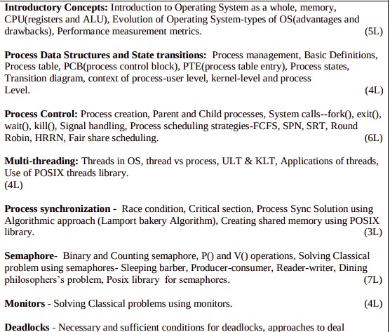
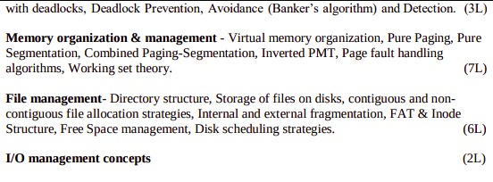

# Operating Systems

## Syllabus

## [Introductory Concepts](introduction)

## [ProcessDataStructursAndStateTransactions](ProcessDataStructursAndStateTransactions)

## References
[https://www.javatpoint.com/history-of-operating-system](https://www.javatpoint.com/history-of-operating-system)