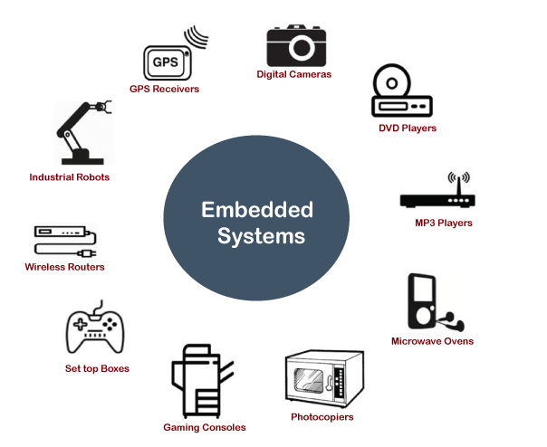
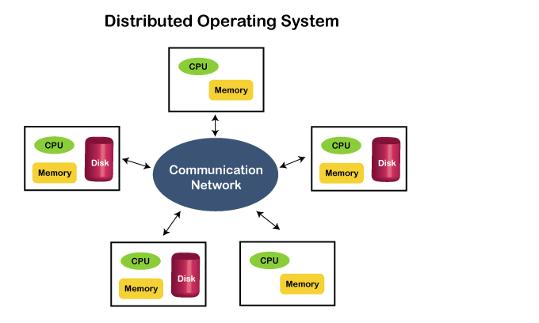

# Introduction

## Introduction About Operating System
An operating system (OS) is the software component of a computer system that is responsible for the management and coordination of activities and the sharing of the resources of the computer. The OS acts as a host for application programs that are run on the machine.

## Memory 
The bridge between Hard drive and CPU. Every data which is to be accessed will gets stored here from harddrive. We can refer this as our RAM.
## CPU
Stands for "Central Processing Unit." The CPU is the primary component of a computer that processes instructions. It runs the operating system and applications, constantly receiving input from the user or active software programs. 

## Evolution of OS
Days back people used to write codes directly in machine language and want to manage all things like using resourses prioritizing their tasks etc by themself.

Then OS evolved which manages the shared resources or shedule the processs etc can be done

OS acts as a bridge between applications and core hardware.

## Types of OS
### 1. Batch Oprating System
Its a bit like old day computer labs where users wont access computer but weite codes and hand over them to computer operator by string in tapes or punch cards. Computer operator runs them and gives output to students when he get.
### 2. Time-Sharing Operating System
- CPU's time is shared between many users so that all people can run their works.

- It extends from multi processing operating system model
### 3. Embedded Operating System
A small os which is relevent to a specific task

Ex: Your camera needs some functionalities. A os is designed for them.
- light in weight
- Task specific
- highly efficient
  
  

### 4. Multiprogramming Operating System
- CPU does our calculations where as IO devices will intreract with us.
- These two are independent to each other and runs parlelly
- When CPU is doing complex operations IO devices can still show the old results

By using this mulyi programming OS is evolved and it makes CPU and IO devices work parlelly and simultaneeously

### 5. Network Operating System
Two types
1. Client Server
   - A server system will be there all others will access resources from it.
   - Assume a lab where all people work on proffessors cpu in their local systems (CS Y DS lab NITDGP batch 2022)
2. Peer to peer
   - Mostly used when people are connected over lan and shre multiple files or resources
   - You can see in hostel. This is rather a way than a OS
### 6. Distributed Operating System
- As an extention to Network based operating systems many cpu's are connected  to a communication network and shares among users.

  

### 7. Multiprocessing Operating System
- Two or more cpu's will be present in only one computer
- This enhances parlellism
### 8. Real-Time Operating System
- want to work in real time
- to be as fast as possible
- Ex: Trafic light signaling
- There are 2 types
    1. Hard Real-Time System 
        - need to work in no time
        - consequences are seviour if this fails
        - system will work on the task in no time
        - Ex: trafic light
    2. Soft Real-Time System
        - needs to work as fast as possible
        - consequences are not that much seviour
        - System will prioratize the needed tasks
        - Ex: Reservation System